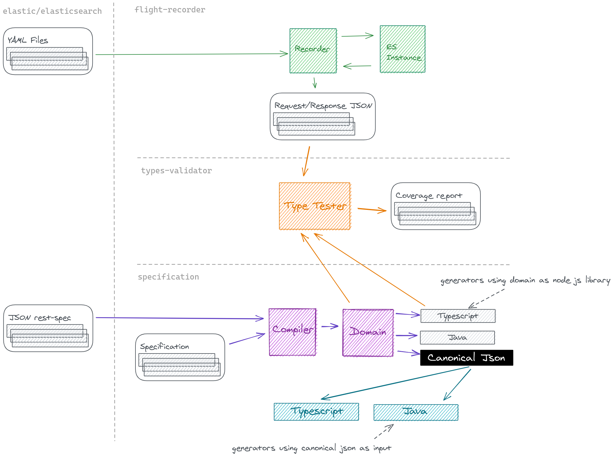

# elastic client generator

This repository contains the Elasticsearch request/response definitions in TypeScript, you can find them inside `/specification/specs`.
The `specification` folder contains a TypeScript program that compiles the entire definition in a custom JSON representation that can be used
for generating other language clients.

## How to generate the JSON representation

// TODO

## How to validate the specification

The specification is validated daily by the [client-flight-recorder](https://github.com/elastic/clients-flight-recorder) project.
The validation result can be found [here](https://github.com/elastic/clients-flight-recorder/blob/dev/recordings/types-validation/types-validation.md).

If you need to fix the specification and then validate the result again, you need to perform the following commands:

```sh
git clone https://github.com/elastic/elastic-client-generator.git
git clone https://github.com/elastic/clients-flight-recorder.git

cd elastic-client-generator
./run-validations
```

The last command above will boot an Elasticsearch instance and start the fligh recorder recording process, once that is finished, it will not be executed
again unless you run again the command like this: `PULL_LATEST=true ./run-validations`.

You can validate a specific API with the `--api` option, same goes for `--request` and `--response`.
For example, the following command validates the index request api:

```js
./run-validations --api index --request
```
The following command validates the index response api:

```js
./run-validations --api index --response
```
The following command validates the index request and response api:

```js
./run-validations --api index --request --response
```

Once you see the errors, you can fix the original definition in `/specification/specs` and then run the command again until
the types validator does not trigger any new error.
Once an api is stable, add the following comment above the api definition:
```js
/**
 * @type_stability stable
 */
```
For example:
```ts
/**
 * @type_stability stable
 */
class IndexRequest<TDocument> extends RequestBase { ... }
```

And finally open a pull request with your changes.


## BirdsEye overview

The work of several repositories come together in this repository. This diagram aims to sketch an overview of how different pieces connect


